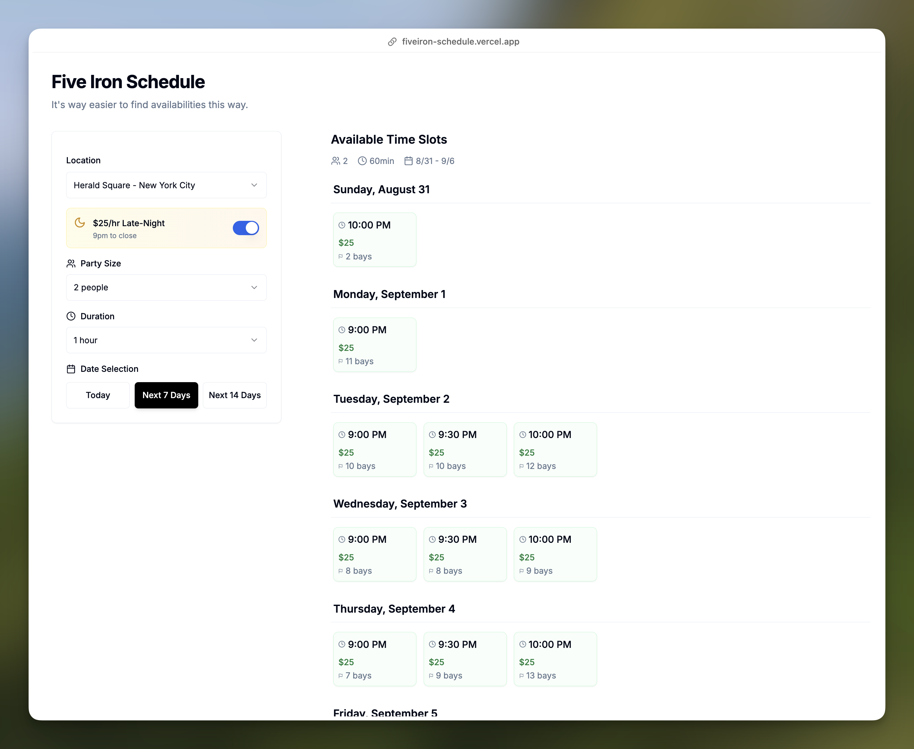

The Five Iron Mobile App is really clunky for booking. You have to chase a date, then a party size, and then a time-
only for it to tell you that time is only availabel for 30 minutes. So, I reversed engineered their booking API and
created a UI that suits my query better:
- Defaults to my location (Herald Square), party size (2), duration (1 hour)
- Shows all availabilties of the results above to the "Next 7 Days" so I can plan my week around the availabilites (it's crazy in NYC)
- Has a "$25/hr Late Night Deal" toggle that will filter the availabilites from 9pm to close. 

